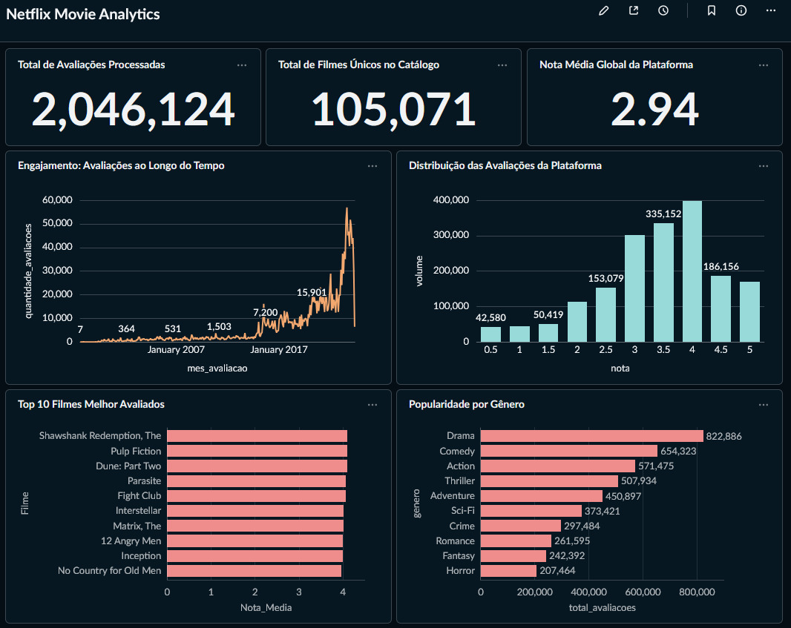

# **Pipeline End-to-End de Engenharia de Dados: MovieLens Analytics**

## **Visão Geral do Projeto**

Este projeto consiste em uma arquitetura completa de **Modern Data Stack (MDS)** construída para extrair, carregar, transformar (ELT) e visualizar os dados do dataset público MovieLens. O objetivo foi desenhar um pipeline escalável e automatizado que simula o rigor de um ambiente produtivo, focando em modelagem dimensional, governança, otimização de custos e experiência de desenvolvimento (DX).  
A orquestração é inteiramente gerenciada pelo **Apache Airflow** (via Astro CLI), garantindo o tráfego dos dados desde a fonte até a entrega de valor em um painel operacional no **Metabase**.

## **Arquitetura e Fluxo de Dados**

O pipeline segue a abordagem **ELT (Extract, Load, Transform)**, dividida nas seguintes etapas:

1. **Extração (Python):** Download automatizado do arquivo .zip hospedado pelo GroupLens e extração seletiva dos arquivos CSV relevantes (movies.csv, user\_rating\_history.csv e belief\_data.csv).  
2. **Data Lake / Landing Zone (GCS):** Upload inteligente dos dados brutos para o Google Cloud Storage.  
3. **Data Warehouse \- Camada Raw (BigQuery):** Criação de *External Tables* apontando para o Data Lake, permitindo leitura via SQL sem duplicar custos de armazenamento.  
4. **Data Warehouse \- Camada Analytics (BigQuery):** Processamento e limpeza dos dados brutos para a criação de tabelas nativas focadas em performance, estruturadas em um modelo dimensional (Star Schema: dim\_movies e fact\_ratings).  
5. **Business Intelligence (Metabase):** Conexão direta com a camada Analytics para disponibilização de métricas de engajamento e catálogo em um dashboard interativo.

## **Destaques Técnicos e Decisões de Engenharia**

Este repositório foi construído com foco nas melhores práticas de Engenharia e Arquitetura de Dados:

* **Idempotência e FinOps no GCS:** O script de upload valida a existência prévia do metadado no Google Cloud (blob.exists()). Se o arquivo já existir, o upload é ignorado, economizando banda de rede e custos de escrita na nuvem.  
* **Infrastructure as Code (IaC) com Airflow:** A criação de datasets e tabelas no BigQuery não foi feita manualmente. Utilizei a TaskFlow API mesclada aos Operadores Clássicos do BigQuery para executar arquivos .sql desacoplados da DAG.  
* **Data Quality na Origem (Null Markers):** Tratamento proativo de anomalias no dataset (como o registro "NA" no campo de notas), instruindo o motor do BigQuery a converter essas sujeiras em NULL logo na leitura da External Table, evitando falhas de *casting*.  
* **Transformação e Regex Avançado:** Uso de Expressões Regulares (REGEXP\_REPLACE e REGEXP\_EXTRACT) para higienização de strings (separação do ano de lançamento embutido no título do filme) e tipagem segura (TIMESTAMP para DATETIME).  
* **Developer Experience (DX) Unificada:** O Metabase foi acoplado ao ecossistema local do Airflow através de um arquivo docker-compose.override.yml. Isso significa que a infraestrutura completa sobe com um único comando de terminal.

## **Dashboard de Resultados**



## **Como reproduzir este projeto**

### **1\. Pré-requisitos**

* **Docker** e Docker Compose instalados e rodando.  
* **Astro CLI** instalado.  
* Uma conta ativa no **Google Cloud Platform (GCP)**.

### **2\. Configuração de Credenciais e Nuvem**

1. No GCP, crie um Bucket no Cloud Storage e anote o ID do seu projeto.  
2. Gere um arquivo de credenciais de usuário (adc.json) através do gcloud auth application-default login.  
3. Crie uma Conta de Serviço (Service Account) com papéis de *Usuário do BigQuery* e *Visualizador de Dados do BigQuery* e baixe a chave JSON para conectar o Metabase.  
4. Clone este repositório: 

   ```Bash  
   git clone https://github.com/KevenGustavo/movie-analytics-pipeline
   cd seu-repositorio
   ```

5. Crie uma pasta oculta chamada credentials/ na raiz do projeto e coloque seus arquivos JSON nela.  
6. Copie o arquivo .env.example, renomeie para .env e preencha com suas informações da nuvem.

### **3\. Executando a Infraestrutura**

Com as variáveis de ambiente configuradas, inicie o orquestrador e o BI simultaneamente rodando:

```Bash
Bash

astro dev start
```

* O **Apache Airflow** estará disponível em: http://localhost:8080 (Ative e execute a DAG movie\_analytics\_ingestion\_taskflow).  
* O **Metabase** estará disponível em: http://localhost:3000.

## **Próximos Passos (Evolução Contínua)**

* Integrar o **dbt (Data Build Tool)** para assumir o papel das transformações SQL, implementando testes automatizados (Testes de Singularidade e Não-Nulos) na camada Analytics.  
* Configurar CI/CD via GitHub Actions para deploy automatizado das DAGs no ambiente cloud.